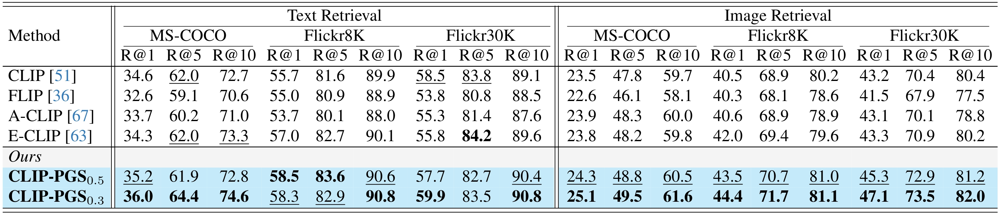

## Seeing What Matters: Empowering CLIP with Patch Generation-to-Selection

<div align="center">
    
</div>

>The text input is processed by the text encoder, while the image undergoes our patch generation-to-selection strategy before entering the image encoder. The loss subsequently aligns the visual and textual embeddings, strengthening cross-modal representation alignment.


## Abstract
>The CLIP model has demonstrated significant advancements in aligning visual and language modalities through large-scale pre-training on image-text pairs, enabling strong zero-shot classification and retrieval capabilities on various domains. However, CLIP’s training remains computationally intensive, with high demands on both data processing and memory. To address these challenges, recent masking strategies have emerged, focusing on the selective removal of image patches to improve training efficiency. Although effective, these methods often compromise key semantic information, resulting in suboptimal alignment between visual features and text descriptions.
In this work, we present a concise yet effective approach called Patch Generation-to-Selection (CLIP-PGS) to enhance CLIP’s training efficiency while preserving critical semantic content. Our method introduces a gradual masking process in which a small set of candidate patches is first pre-selected as potential mask regions. Then, we apply Sobel edge detection across the entire image to generate an edge mask that prioritizes the retention of the primary object areas. Finally, similarity scores between the candidate mask patches and their neighboring patches are computed, with optimal transport normalization refining the selection process to ensure a balanced similarity matrix.
Our approach, CLIP-PGS, sets new state-of-the-art results in zero-shot classification and retrieval tasks, achieving superior performance in robustness evaluation and language compositionality benchmarks.


<div align="center">
    
</div>

>Visual comparison of masking strategies: random masking, cluster-based masking, and our proposed CLIP-PGS.

<div align="center">
    
</div>

>Performance comparison of vision-language pre-training models, such as CLIP, FLIP, A-CLIP, E-CLIP, and the proposed CLIP-PGS, evaluated across three critical dimensions: (a) generalizability, (b) robustness, and (c) compositionality.

## 1. Pre-training
Refer to [OpenCLIP](https://github.com/mlfoundations/open_clip) for instructions on installation and data downloads.
```bash
# CLIP-PGS-0.5 and CLIP-PGS-0.3
bash clip-train.sh 
```

## 2. Downstream Evaluation Tasks
Kindly ensure that ```clip-benchmark``` is installed before running the script below.

```bash
# Step 1: install clip-benchmark
pip install clip-benchmark
```

```bash
# Step 2: Zero-Shot Classification, Zero-Shot Retrieval, Linear Probing Classification, Robustness Assessment, and Language Compositionality
bash clip-test.sh
```

## 3. Quantitative Results
*Zero-Shot Classification*
<div align="center">
    
</div>

*Zero-Shot Retrieval*
<div align="center">
    
</div>

*Linear Probing Classification*
<div align="center">
    
</div>

*Robustness Assessment*
<div align="center">
    
</div>

*Language Compositionality*
<div align="center">
    
</div>

## 4. Qualitative Results
*Zero-Shot Retrieval (Text-to-Image)*
<div align="center">
    
</div>


*Zero-Shot Retrieval (Image-to-Text)*
<div align="center">
    
</div>

## Acknowledgement
This repository based on [CLIP](https://github.com/OpenAI/CLIP) and [OpenCLIP](https://github.com/mlfoundations/open_clip).


